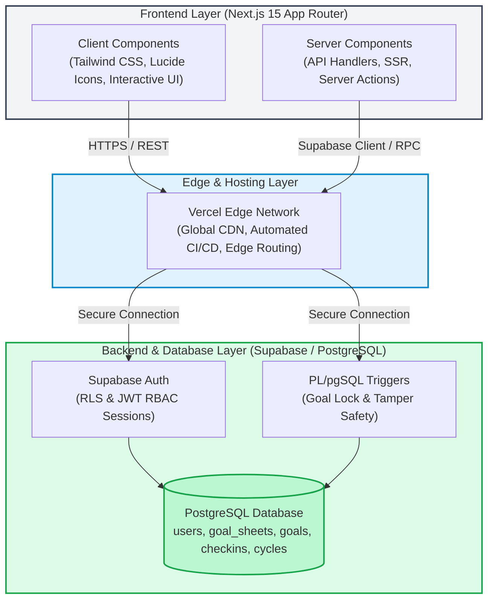

# AtomQuest Goal Portal — System Architecture 🏛️

AtomQuest is built on a modern, decoupled serverless architecture designed for maximum speed, enterprise-grade security, and real-time reliability.

---

## 📊 Visual Architecture (Mermaid)



---

## 🖥️ Structural ASCII Diagram

```
┌─────────────────────────────────────────────────────────┐
│                     Next.js 15 (App Router)             │
│   ┌────────────────────────┐   ┌────────────────────┐   │
│   │   Client Components    │   │ Server Components  │   │
│   │ (Tailwind, Lucide, UI) │   │  (API, Auth, SSR)  │   │
│   └───────────┬────────────┘   └─────────┬──────────┘   │
└───────────────┼──────────────────────────┼──────────────┘
                │                          │               
                │ HTTPS / REST             │ Supabase Client / RPC
                ▼                          ▼               
┌─────────────────────────────────────────────────────────┐
│                   Vercel Edge Network                   │
│      (Global CDN, Edge Functions, Automated CI/CD)      │
└───────────────────────────┬─────────────────────────────┘
                            │                              
                            │ Secure Connection            
                            ▼                              
┌─────────────────────────────────────────────────────────┐
│                  Supabase (PostgreSQL)                  │
│   ┌────────────────────────┐   ┌────────────────────┐   │
│   │     Supabase Auth      │   │  Database Triggers │   │
│   │    (RLS & JWT RBAC)    │   │ (Goal Lock Safety) │   │
│   └───────────┬────────────┘   └─────────┬──────────┘   │
│               │                          │              
│               ▼                          ▼              
│   ┌─────────────────────────────────────────────────┐   │
│   │                 Core Tables                     │   │
│   │  (users, goal_sheets, goals, checkins, cycles)  │   │
│   └─────────────────────────────────────────────────┘   │
└─────────────────────────────────────────────────────────┘
```

---

## 🔍 Key Architectural Highlights

### 1. Frontend Layer (Next.js 15 & Tailwind CSS)
- **App Router:** Utilizes the Next.js 15 App Router for seamless Server-Side Rendering (SSR), optimized client-side interactivity, and advanced routing.
- **Styling System:** Styled entirely with vanilla Tailwind CSS, creating a premium, highly responsive glassmorphism aesthetic with tailored micro-animations.
- **Component Architecture:** Clean separation of Client Components (for rich interactive states like the Goal Progress Ring and live filtering) and Server Components (for secure data fetching and initial page loads).

### 2. Hosting & Edge Network (Vercel)
- **Serverless Hosting:** Deployed serverlessly on Vercel, providing automated branch previews, zero-config CI/CD pipelines, and blazing-fast edge routing.
- **Global CDN:** Static assets and pre-rendered pages are distributed globally across Vercel's Edge Network for instant load times.

### 3. Backend & Database Layer (Supabase / PostgreSQL)
- **Role-Based Access Control (RBAC):** Supabase Auth manages secure JSON Web Token (JWT) sessions. Custom middleware (`middleware.ts`) enforces strict RBAC at the edge, redirecting users based on role (`employee`, `manager`, `admin`).
- **Un-Bypassable Data Integrity:** Strict PL/pgSQL database triggers (`supabase/migrations/003_audit_trigger.sql`) act as a database-level safety net, preventing direct mutations to approved or locked goal sheets.
- **Centralized Core Logic:** Pure utility modules (`lib/scoring.ts` and `lib/audit.ts`) guarantee consistent score calculations and tamper-evident audit trails across all server endpoints and API routes.
